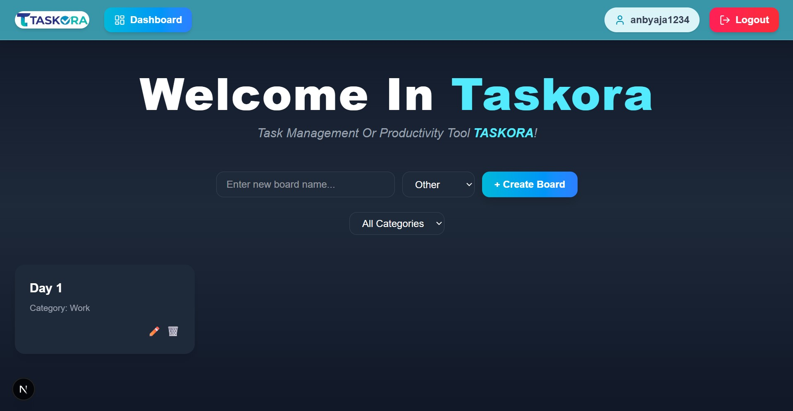

# Taskora

Taskora adalah aplikasi to-do list modern yang membantu pengguna mengatur dan melacak tugas harian secara efisien. Aplikasi ini dirancang cepat, ringan, realtime, serta tetap berfungsi dalam kondisi offline melalui pendekatan **offline-first**.

✨ **Live Demo:** https://taskora-phi.vercel.app/

---

## 📸 Tampilan



---

## 🚀 Fitur Utama

- **Realtime Sync** — perubahan tugas tersinkron otomatis antar perangkat.  
- **Offline-First** — aplikasi tetap bekerja walaupun tanpa koneksi internet.  
- **UI Modern & Responsif** — tampilan clean, cepat, dan nyaman digunakan.  
- **Autentikasi Pengguna** — login aman melalui Supabase Auth.  
- **Manajemen Tugas Lengkap** — tambah, edit, hapus, tandai selesai, dsb.

---

## 🛠 Teknologi yang Digunakan

| Teknologi              | Fungsi                                                         |
|------------------------|-----------------------------------------------------------------|
| **Next.js (App Router)** | Frontend + backend API Routes untuk performa tinggi           |
| **Tailwind CSS**       | Styling cepat, konsisten, dan modern                           |
| **Supabase**           | Database utama, autentikasi, dan fitur realtime                |
| **Vercel**             | Deployment cepat & stabil untuk aplikasi Next.js               |

---

## 👤 Peran Saya

Sebagai **Fullstack Developer**, saya bertanggung jawab untuk:

- Mendesain UI yang modern dan responsif.  
- Mengelola integrasi **realtime** menggunakan Supabase.  
- Membangun API dengan **Next.js API Routes**.  
- Menerapkan strategi **offline-first** (caching, local storage).  
- Mengoptimalkan performa aplikasi untuk skala data besar.

---

## 🔥 Tantangan

- Menjaga konsistensi data realtime antar perangkat.  
- Mengoptimalkan performa saat jumlah tugas sangat banyak.  
- Menjamin keamanan proses autentikasi dan API.

---

## ✅ Solusi

- Menggunakan **Supabase Realtime** untuk sinkronisasi instan.  
- Menerapkan cache lokal dan strategi offline-first agar pengguna tetap produktif tanpa internet.  
- Optimasi query, state management, dan teknik rendering virtualized list bila diperlukan.  
- Menjalankan logic sensitif di API Routes untuk meningkatkan keamanan.

---

## 📁 Struktur Proyek (Ringkas)

```bash
app/
├── api/
│   └── generate/route.ts
├── boards/[boardId]/page.tsx
├── dashboard/page.tsx
├── login/page.tsx
├── register/page.tsx
├── layout.tsx
├── page.tsx
├── globals.css
components/
├── layout.tsx
└── navbar.tsx
lib/
└── supabase.ts
public/
└── (assets)

next.config.js                # Next.js configuration  
tsconfig.json                 # TypeScript configuration  
package.json                  # Dependencies & scripts
```
---

## 🧩 Cara Menjalankan Proyek

```bash
# Install dependencies
npm install

# Jalankan development server
npm run dev

# Buka di browser
http://localhost:3000
```
